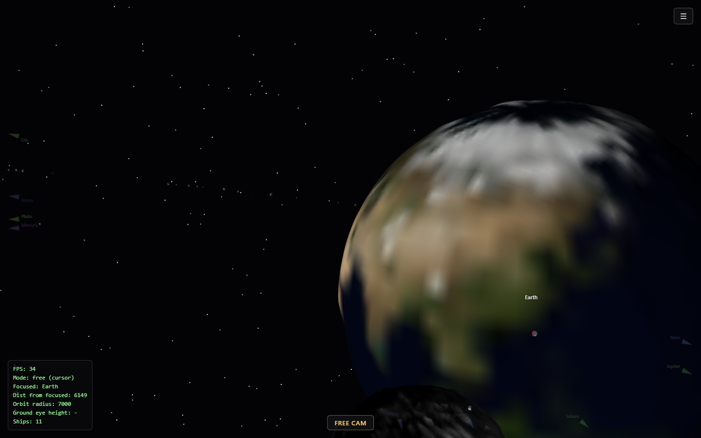
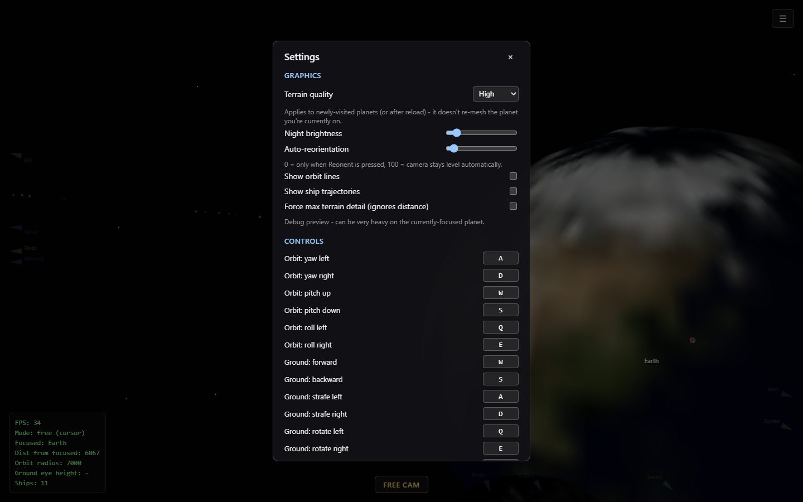

# ExperimentRTS

A browser solar-system sandbox in Babylon.js: fly between planets built from real NASA and USGS elevation and colour maps, swap between true and compressed orbital scale, and watch a trade fleet fly between stations.

   



There is no hosted build. Run it locally with Vite (see Quick start).

## Why

- Fly the real solar system: the Sun and eleven bodies from Mercury to Eris, including the Moon, with real elevation data on Mercury, Venus, Earth, the Moon, Mars and Pluto.
- See distances as they really are: one key eases every orbit between a playable compressed scale and true real-world proportions.
- Get Google Earth style navigation in space: double-click a planet to warp to it, orbit it with a trackball camera, and drop to the surface.
- Watch an economy run on its own: 11 ships plan their flights between 6 stations and fly flip-and-burn transits.
- Learn from honest data choices: every texture and heightmap has a documented public source, and bodies without real data are left procedural rather than faked.

## Features

### Planets and terrain

- Cube-sphere quadtree terrain with level-of-detail patches that split as the camera gets closer, plus procedural topology for bodies without data (`src/terrain`).
- Real heightmaps for Mercury (MESSENGER), Venus (Magellan radar), Earth (SRTM/GTOPO), the Moon (LRO LOLA), Mars (MGS MOLA) and Pluto (New Horizons). Eris has never been resolved and stays procedural.
- Real colour maps for Mercury, Earth, Mars and Jupiter; stylized maps for Saturn, Uranus and Neptune.
- Saturn's ring, an asteroid belt, a starfield and stellar dust streaks during transit.

### Cameras

- Free cam with right-mouse mouselook, cursor mode, and reticle selection.
- Double-click a planet to warp to it; double-tap F to enter focus mode around the selected target.
- Free trackball orbit camera with WASD yaw and pitch, Q and E roll, optional lock to the solar plane, and auto-reorientation.
- Automated camera transitions route around planets in the way.
- An RTS ground camera with drag-to-pan and draggable unit-selection circles on planet surfaces. Ground mode is currently gated off in code, with the logic kept.

### Trade layer

- Base cuboids on every landable body and torus space stations in geosynchronous orbit, their mouths facing the planet.
- Two factions, the Sol Federation and the Belt Consortium.
- Ships that rendezvous with stations using a flip-and-burn flight profile, with routes planned before departure and distant ships drawn as billboards.
- Hold Alt for examine placards on bases, stations and ships.

### Interface

- A breadcrumb hierarchy browser for picking a focus target, off-screen edge arrows for planets and moons, always-on name labels and real distance from the Sun or parent body.
- A settings modal with terrain quality, night brightness, auto-reorientation, orbit lines, ship trajectories, a max-terrain debug switch and rebindable controls saved in the browser.



## Quick start

Prerequisites: Node.js and npm.

```bash
git clone https://github.com/mindattic/ExperimentRTS.git
cd ExperimentRTS
npm install
npm run dev
```

Open the URL Vite prints. `npm run build` type-checks and builds to `dist/`; `npm run preview` serves the build.

## Controls

Defaults, all rebindable in Settings:

| Action | Key |
| --- | --- |
| Orbit yaw, pitch | A and D, W and S |
| Orbit roll | Q and E |
| Free cam up, down | E and Q |
| Toggle free cam | F |
| Enter focus mode around the selected target | F twice |
| Reorient camera | R |
| Lock orbit to the solar plane | P |
| Open focus list | 1 |
| Select target (free cam) or plot course (orbit) | Space |
| Toggle info labels | L |
| Toggle actual and gameplay orbital scale | Backquote |
| Exit ground mode | Escape |

Mouse: double-click a planet to warp to it, hold the right button for free-look.

## Project layout

```text
src/
  main.ts              scene setup, modes, input wiring
  camera/              free-fly, orbit trackball, RTS ground, mouselook, path avoidance
  solarSystem/         bodies, orbits, actual vs gameplay scale, asteroid belt
  terrain/             cube-sphere quadtree LOD, heightfields, noise, heightmap images
  economy/             bases, stations, ships, transit planning, factions
  environment/         star, starfield, stellar dust
  ui/                  selection, examine placards, body icons, off-screen indicators, settings
  input/keybindings.ts default bindings and browser-saved overrides
  settings/            graphics settings
public/
  heightmaps/          elevation maps and SOURCES.md
  textures/            colour maps and SOURCES.md
```

## Limitations

- An experiment, not a game yet: despite the name, RTS ground mode is switched off and there are no win conditions.
- Saturn, Uranus and Neptune use stylized textures because no true global map exists for them; Venus and the Moon keep procedural colouring for the same reason (see the SOURCES files).
- Terrain detail is tuned for about 30 fps at close range; full resolution at long distances would need a different approach.

## Documentation

- [public/textures/SOURCES.md](public/textures/SOURCES.md): colour map sources and licenses
- [public/heightmaps/SOURCES.md](public/heightmaps/SOURCES.md): elevation map sources
- [AGENTS.md](AGENTS.md): instructions for AI agents working in this repo

## License

This repo has no LICENSE file. All rights reserved for the code. Heightmaps and most colour maps are public domain NASA and USGS data. Saturn, Uranus and Neptune textures are by Solar System Scope (solarsystemscope.com/textures), CC BY 4.0.

Part of [MindAttic](https://mindattic.com) — see more projects at [github.com/mindattic](https://github.com/mindattic). Related: [ExperimentEve](https://github.com/mindattic/ExperimentEve).
